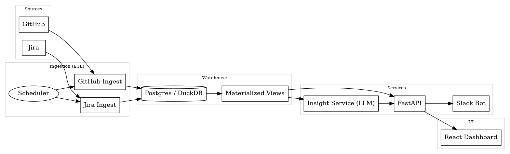

# Engineering Metrics Dashboard

A lightweight data platform and dashboard that ingests GitHub and Jira activity, computes DORA + flow metrics, and uses an LLM to surface **Sprint Health** insights and bottlenecks—refreshing on a schedule and posting summaries to Slack.

<p align="center">
  
</p>

## ✨ Highlights

- **End-to-end system**: ETL → Warehouse → API → Web UI → Slack.
- **DORA + Flow metrics**: Deployment frequency, lead time, PR cycle time, time-to-first-review, scope change %, carryover %.
- **AI Insights**: LLM-generated “Sprint Health” card with risks and recommended actions.
- **Idempotent ETL**: Backfills and windowed incremental updates; rate-limit aware.
- **Batteries-included monorepo**: API (FastAPI), ETL jobs (Python), Dashboard (React), infra (Docker).

## 🧭 Architecture Overview

**Sources**: GitHub + Jira → **ETL Jobs** (Python, scheduled) → **Warehouse** (Postgres or DuckDB) → **API** (FastAPI) → **Dashboard** (React) + **Slack Bot** for summaries.

Key design choices:

- **Materialized views** for expensive aggregations; refreshed per date window.
- **Stateless API** with clean filter semantics (org/team/repo/date).
- **LLM isolation**: small, deterministic prompt; retries with backoff; token caps.
- **Observability**: structured logs + simple request tracing and ETL run logs.

## 🧱 Monorepo Layout

```
engineering-metrics-dashboard/
├── etl/                 # Ingestion jobs (GitHub/Jira) + schedulers
├── api/                 # FastAPI service (metrics + insights endpoints)
├── dashboard/           # React web app (tiles, charts, filters)
├── db/                  # Schema, migrations, seeds, views
├── infra/               # Docker, compose, deploy configs, Makefile
├── tests/               # Unit + slim integration tests
└── README.md
```

## 🗄️ Data Model (v1)

Tables (simplified):

- `github_pull_requests(pr_id, repo, author, created_at, merged_at, first_review_at, reviewers[], comments_count, reopened_count, target_branch)`
- `github_commits(sha, pr_id, author, authored_at, committed_at)`
- `jira_issues(key, type, points, status, created_at, resolved_at, sprint_id, assignee)`
- `jira_sprints(id, name, start, end, completed)`
- `metrics_daily(org, team, repo, date, dora_*, flow_*, planning_*)` (denormalized cache)

Materialized views:

- `mv_dora_by_repo_day`
- `mv_flow_by_repo_day`
- `mv_planning_by_sprint`

## 📊 Core Metrics

- **DORA-ish**: Deployment Frequency (≈ merges to main), Lead Time for Changes (first commit → merge).
- **Flow/Cycle**: PR cycle time (open → merge), Time-to-First-Review, Review Depth, Rework Rate (re-opened PRs).
- **Planning/Predictability**: Planned vs. Done, Scope Change %, Carryover %, Blocked ticket age.
- **Quality proxy**: Hotfix rate (release-branch merges ≤ N days post release).

## 🤖 Sprint Health (LLM)

**Inputs**: last sprint aggregates (cycle time p50/p90, review latency, scope change %, carryover %, deploy freq) + top anomalies.  
**Output** (≤ 180 words): 3 insights, 2 risks, 3 recommendations (actionable and specific).

Prompt sketch:

```
Given the following sprint metrics and anomalies, summarize Sprint Health with:
- Three concise insights (what changed, by how much, why it matters)
- Two key risks (probable impact)
- Three specific recommendations
Keep it under 180 words.
DATA: {{json_metrics_blob}}
```

## 🧪 API Surface (initial)

- `GET /metrics/tiles?team=&repo=&from=&to=` → summary tiles.
- `GET /metrics/series/cycle-time?team=&repo=&granularity=day` → timeseries.
- `GET /insights/sprint-health?team=&sprint=` → current LLM card + source metrics.
- `POST /slack/summaries` → web hook trigger (optional manual post).

## 🔐 Config & Secrets

Environment variables (example):

```
GITHUB_TOKEN=...
JIRA_BASE_URL=https://your-domain.atlassian.net
JIRA_EMAIL=you@company.com
JIRA_API_TOKEN=...
DATABASE_URL=postgresql://metrics:metrics@db:5432/metrics
OPENAI_API_KEY=...
SLACK_BOT_TOKEN=xoxb-...
SLACK_CHANNEL_ID=C12345678
```

Use a secrets manager in production. Tokens should be least-privilege and revocable.

## 🚀 Running Locally

1. Install Docker & Docker Compose.
2. Clone repo and copy `env.example` → `.env`, fill in tokens (or use mock mode).
3. Start services:
   ```bash
   docker compose up --build
   ```
4. Open:
   - API docs: http://localhost:8000/docs
   - Dashboard: http://localhost:5173

## 🗓️ Scheduling ETL

- Default: ETL jobs run hourly via APScheduler (inside ETL service) with backoff.
- First run does a **backfill** (last 30 days) to warm caches.

## 🧹 Quality & Observability

- **Tests**: `pytest` for ETL libs and API routes.
- **Lint/Type**: `ruff` + `mypy` (Python), `eslint` + `tsc` (frontend).
- **Logs**: JSON logs with run IDs; ETL success/failure counters.

## 🛣️ Roadmap

- OAuth setup flow + multi-tenant project config
- Team ownership mapping (CODEOWNERS → repo/team)
- Anomaly detection (z-score) fed to insight prompts
- Drilldowns: PR type segmentation (feature/bug/hotfix)
- SLOs / error budgets view (service-level)
- Export to Notion/Google Slides for exec readouts

## 📸 Demo Ideas

- 60–90s screencast: filter by team → watch tiles update → view Cycle Time p90 trend → open Slack’s end-of-sprint summary → click back to dashboard.

## 📜 License

MIT (adjust as needed).
